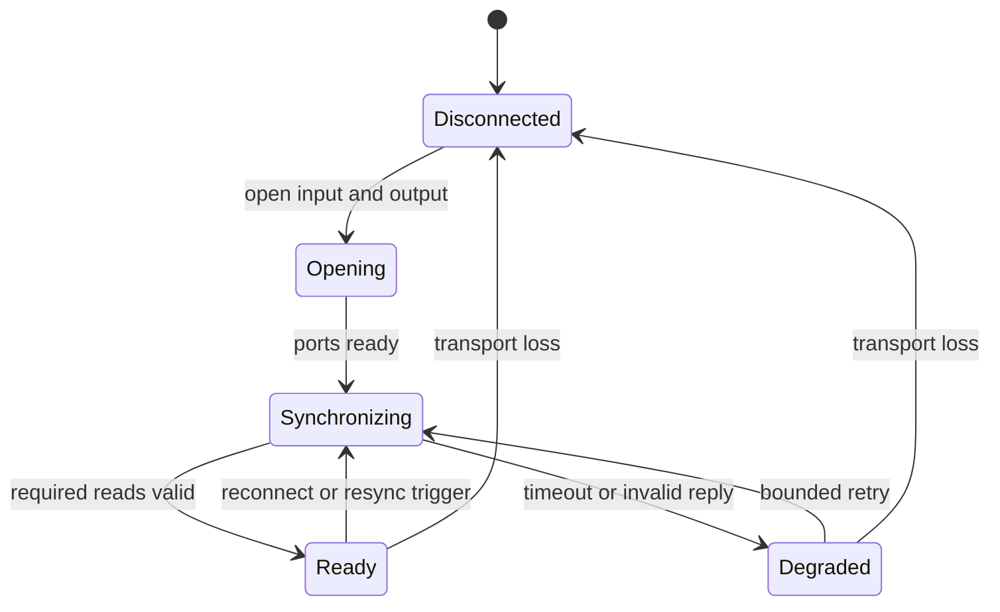

# v1.0.0 original KATANA-100 SysEx state-awareness specification

**Audience:** Codex in the VS Code extension and repository maintainers  
**Target:** original 100 W BOSS KATANA-100 (Mk I), Windows, current `dev` branch  
**Baseline:** repository version `0.4.0`, commit `a32fb31`  
**Document status:** implementation brief based on public reverse engineering;
hardware capture and reproduction on the user's amplifier remain mandatory  
**Last researched:** 2026-08-29

> This document changes the proposed v1.0.0 boundary. The older roadmap says
> authoritative state synchronization is post-v1. The owner's current release
> decision is that v1.0.0 must first stop relying on assumed effect defaults.
> Therefore **read-only, hardware-validated Mk I SysEx state synchronization is
> a v1.0.0 release gate**. General deep-parameter writes, patch storage, and Mk II
> SysEx support are not v1.0.0 gates.

## 1. Executive decision

Use two complementary MIDI planes:

| Plane | v1.0.0 role | Reason |
|---|---|---|
| Standard Program Change and Control Change | Continue selecting presets and switching grouped effects | Already implemented and physically validated on the target Mk I amp |
| BOSS/Roland SysEx RQ1 reads and DT1 replies | Discover the current preset and actual temporary-patch effect flags | Replaces guessed `presetStates` with amplifier truth |
| BOSS/Roland SysEx DT1 writes | Excluded except for the short editor/control-mode handshake needed by a validated read | Minimizes the chance of changing or corrupting a live tone |

The first stable SysEx feature is a **sensor**, not a general editor. In
particular, do not turn `parameters.py` into a catalogue of writable community
addresses and then expose a generic `setParameter` action. That would enlarge
the safety and hardware-validation surface without solving the immediate stale
state problem.

The v1.0.0 truth model must retain the six individual Mk I effect flags:

```text
Boost, Mod, Delay, FX, Reverb, Send/Return
```

Do not store only the four existing profile keys:

```text
booster, delay, reverb, effectLoop
```

On Mk I, Booster/Mod and Delay/FX share physical controls and standard MIDI CCs,
but the temporary patch contains separate effect flags. Third-party editors can
produce states in which both members of a shared group are active. A single
boolean cannot represent that state honestly.

## 2. Why this is the correct v1.0.0 scope

The current controller does this:

1. A Program Change loads configured `presetStates`.
2. `toggleEffect()` negates the cached boolean.
3. A CC is sent and the cache is updated optimistically.

That state becomes wrong when any of these occur:

- the amp starts on a different Panel/channel than the configuration assumes;
- a preset was edited after the JSON profile was written;
- the front panel, GA-FC, another MIDI controller, or Tone Studio changes state;
- the amp reconnects while the BlueBoard bridge remains alive;
- a command is sent successfully at the host boundary but ignored by the amp;
- a Mk I patch has simultaneous Boost+Mod or Delay+FX state;
- a grouped effect changes which member is active.

Readback changes the controller contract from “send and assume” to “read,
actuate, then verify.” It also creates the prerequisite for persistent BlueBoard
LEDs without pretending that a button press is the same as amplifier state.

## 3. Evidence boundary

BOSS does not publish a Katana Mk I SysEx MIDI implementation chart. The useful
map is community reverse engineering derived from observing BOSS Tone Studio and
from working controller/editor implementations. Consequently, every address in
this document is a **candidate until reproduced on the user's exact amp and
firmware**.

Use these evidence labels in code and fixtures:

| Label | Meaning | Production read allowed? | Production write allowed? |
|---|---|---:|---:|
| `official` | Explicit BOSS/Roland documentation for the exact model/behavior | Yes | Only with a separately reviewed safety case |
| `capturedMkI` | Captured and reproduced on the user's original KATANA-100 and recorded firmware | Yes | Only if that address was separately write-tested and restored |
| `communityMkI` | Two or more independent Mk I source implementations agree | Probe only | No |
| `legacyKatana` | Present in older Mk I reverse-engineering material but not yet cross-checked | Probe only | No |
| `inferred` | Derived from neighboring addresses or another Roland/BOSS product | No | No |
| `unverifiedPlaceholder` | Design placeholder | No | No |

The current `ParameterDefinition.mayWrite` policy allows `official` and
`capturedMkII`, which reflects the repository's former Mk II-first assumption.
Before SysEx work lands, replace the model-specific evidence vocabulary with a
read/write capability policy. A definition being safe to read does not imply it
is safe to write.

## 4. Source assessment

### 4.1 Vendor sources

- The [original KATANA-100 support page](https://www.boss.info/us/support/by_product/katana-100/)
  is the source of truth for the model family, driver, manuals, and software.
- BOSS lists [KATANA System Program 4.00](https://www.boss.info/us/support/by_product/katana-100/updates_drivers/dd6f99a6-4a76-4138-8fbf-52179d3c224d/)
  as the original-generation update and explicitly says it is not for Mk II.
  It pairs original Katana version 4 with BOSS Tone Studio for KATANA Version 3.
- Roland's published MIDI implementation documents for other devices establish
  the general RQ1/DT1/checksum convention, but they do **not** make the Katana
  address map official.

### 4.2 Primary reverse-engineering sources

- Steven Hirsch's
  [`katana_sysex.txt`](https://github.com/snhirsch/katana-midi-bridge/blob/2125ce90a2fb937b554427f0c993444191eb266e/doc/katana_sysex.txt)
  documents the Mk I frame, checksum, current-preset query, front-panel/system
  area, temporary-patch addresses, and editor-mode handshake.
- The accompanying
  [`katana.py`](https://github.com/snhirsch/katana-midi-bridge/blob/2125ce90a2fb937b554427f0c993444191eb266e/katana.py)
  is an executable reference for Mido framing, request/reply input handling,
  base-128 lengths, timeouts, and chunked replies. It is valuable evidence, but
  its one-request condition-variable design and fixed five-second waits should
  not be copied unchanged.
- `katana-dev/docs` records Mk I tests and warns that the system area can conflict
  with temporary-patch values. Its
  [patch-capability map](https://github.com/katana-dev/docs/blob/ed018f335bbb16a50afd62357b9423e69efda2cf/tables/patch-capabilities.md)
  distinguishes stored patch locations from the live temporary patch.
- VController's
  [`MD_KTN.ino`](https://github.com/sixeight7/VController_v3/blob/7194214cc1ccf4f6df3a3849a7bea75232fc0e3b/Firmware/VController_v3/MD_KTN.ino)
  independently implements Mk I and Mk II address variants, validates incoming
  checksums, queries the current patch, and reads individual Mk I effect switches.

### 4.3 What the sources do not prove

They do not prove that:

- the user's current firmware is version 4.00;
- Windows exposes the same usable name for input and output;
- the target driver permits Tone Studio and this bridge to own the ports at once;
- every address responds without editor mode on this amplifier;
- unsolicited changes are emitted reliably enough to replace polling;
- any write is safe for a stable live-performance release.

Those points require a dated local capture and physical observation.

## 5. SysEx is a protocol layer, not middleware

The transport is still USB MIDI. SysEx is the manufacturer-specific message
language carried over that transport:

```text
iRig BlueBoard --BLE-MIDI--> bridge --USB-MIDI PC/CC/RQ1--> KATANA
                                      <--USB-MIDI DT1-------
```

Tone Studio behaves as an editor/controller. The Katana remains the audio and DSP
device. The v1 bridge will implement only the subset of that language needed to
observe state.

## 6. Mk I frame format

All values inside a MIDI SysEx message must be seven-bit bytes (`00` through
`7F`). Full-wire messages use the following envelope:

```text
F0 41 <deviceId> 00 00 00 33 <command> ... <checksum> F7
```

| Field | Bytes | Meaning |
|---|---:|---|
| `F0` | 1 | SysEx start |
| `41` | 1 | Roland manufacturer ID |
| `deviceId` | 1 | Observed examples commonly use `00`; do not make the parser depend on an unexplained constant |
| `00 00 00 33` | 4 | Katana model ID used by the Mk I sources |
| `11` | 1 | RQ1-style request: read an address/range |
| `12` | 1 | DT1-style data: request reply or write |
| address | 4 | Base-128 address bytes |
| size or data | 4 or more | RQ1 has four size bytes; DT1 has data bytes |
| checksum | 1 | Roland checksum over address plus size/data |
| `F7` | 1 | SysEx end |

### 6.1 RQ1 read request

```text
F0 41 <deviceId> 00 00 00 33 11
   <a0> <a1> <a2> <a3>
   <s0> <s1> <s2> <s3>
   <checksum> F7
```

The four-byte size is a base-128 range extent. Hirsch observed that the amp can
skip undefined address regions, so a large requested span is not a promise of
one contiguous reply containing exactly that number of data bytes.

### 6.2 DT1 data reply or write

```text
F0 41 <deviceId> 00 00 00 33 12
   <a0> <a1> <a2> <a3>
   <data...>
   <checksum> F7
```

There is no transaction ID. A request manager must correlate replies by validated
device/model header, address, expected span, and current connection epoch.

### 6.3 Mido representation

Mido's `Message('sysex').data` excludes `F0` and `F7`. With that representation,
the normalized data bytes are:

```text
41 <deviceId> 00 00 00 33 12 <address:4> <data...> <checksum>
```

Do not mix full-wire indexes with Mido-data indexes. Normalize immediately into
a typed frame so the rest of the code never performs magic slicing.

## 7. Checksum and base-128 arithmetic

The checksum covers only the four address bytes plus the request size or DT1
data bytes:

```python
checksum = (0x80 - (sum(addressAndSizeOrData) & 0x7F)) & 0x7F
```

Equivalent verification:

```python
(sum(addressAndSizeOrData) + checksum) & 0x7F == 0
```

All operands must first be checked as integers from `0x00` to `0x7F`. Rejecting
bad input is safer than silently masking it.

Treat four-byte addresses and sizes as base-128 numbers:

```text
scalar = b0*0x200000 + b1*0x4000 + b2*0x80 + b3
```

Do not use ordinary hexadecimal carry between address bytes. For example, the
successor to `00 00 00 7F` is `00 00 01 00`, not `00 00 00 80`.

## 8. Exact read vectors for initial probing

The following examples use device ID `00`. Their checksums were recalculated
from the documented algorithm. They are **read-only probe candidates**, not
hardware-validation results.

### 8.1 Editor/control mode

The current-preset query is reported to require a short editor/control-mode
transaction:

```text
enter: F0 41 00 00 00 00 33 12 7F 00 00 01 01 7F F7
exit:  F0 41 00 00 00 00 33 12 7F 00 00 01 00 00 F7
```

Wait approximately 50–100 ms after entering before issuing the current-preset
request. Always attempt the exit message in `finally`, on timeout, on Ctrl+C,
and before closing the output. Do not leave editor mode enabled for the whole
performance session until captures prove that doing so is both useful and safe.

### 8.2 Current Panel/channel

```text
request:
F0 41 00 00 00 00 33 11 00 01 00 00 00 00 00 02 7D F7

candidate response shape:
F0 41 00 00 00 00 33 12 00 01 00 00 00 <selection> <checksum> F7
```

Reported response data:

| Data | Selection |
|---:|---|
| `00 00` | Panel |
| `00 01` | CH1 |
| `00 02` | CH2 |
| `00 03` | CH3 |
| `00 04` | CH4 |

The legacy document predates Bank B. On a firmware that supports Bank A/B, do
not invent meanings for additional values. Capture Program Change 0–8 against
the query and record the exact response mapping. Until then, a non-listed value
must parse as `unknown(rawBytes=...)`, not as a guessed channel.

### 8.3 Firmware-family probe candidate

VController requests one byte at `7F 00 00 00` and interprets returned value `05`
as original Katana firmware generation 4 (`value - 1`). The candidate request is:

```text
F0 41 00 00 00 00 33 11 7F 00 00 00 00 00 00 01 00 F7
```

Use this as supporting evidence only. The user must still record the firmware by
the BOSS-prescribed physical version check. Do not select a writable address map
solely from this byte.

### 8.4 Individual live temporary-patch effect flags

Each of these requests asks for one byte. Reported values are `00` off and `01`
on.

| State | Address | Exact RQ1 request with device ID `00` | Initial evidence |
|---|---|---|---|
| Boost | `60 00 00 30` | `F0 41 00 00 00 00 33 11 60 00 00 30 00 00 00 01 6F F7` | Hirsch + VController agreement |
| Mod | `60 00 01 40` | `F0 41 00 00 00 00 33 11 60 00 01 40 00 00 00 01 5E F7` | Hirsch + VController agreement |
| FX | `60 00 03 4C` | `F0 41 00 00 00 00 33 11 60 00 03 4C 00 00 00 01 50 F7` | Hirsch + VController agreement |
| Delay | `60 00 05 60` | `F0 41 00 00 00 00 33 11 60 00 05 60 00 00 00 01 3A F7` | Hirsch + VController agreement |
| Reverb | `60 00 06 10` | `F0 41 00 00 00 00 33 11 60 00 06 10 00 00 00 01 09 F7` | Hirsch + VController agreement |
| Send/Return | `60 00 06 55` | `F0 41 00 00 00 00 33 11 60 00 06 55 00 00 00 01 44 F7` | VController temporary-patch map |

The first byte of each effect block is the switch. Some implementations request
two bytes so the second byte also yields the effect type. v1.0.0 should initially
request one byte because it is the minimum data needed for state awareness. Add
type reads only after the one-byte state path is stable.

### 8.5 System/front-panel observations

These are useful diagnostic reads but are not substitutes for the temporary
patch flags:

| Observation | Address | Reported values |
|---|---|---|
| Send/Return common active | `00 00 04 00` | `00` off, `01` on |
| Booster/Mod color | `00 00 04 10` | `00` off, `01` green, `02` red, `03` yellow |
| Delay/FX color | `00 00 04 11` | same |
| Reverb color | `00 00 04 12` | same |
| Booster/Mod color+range | `00 00 04 13` | `00` off, `01`–`03` range A colors, `04`–`06` range B colors |
| Delay/FX color+range | `00 00 04 14` | same |
| Reverb color+range | `00 00 04 15` | `00` off, `01`–`03` colors; range-B values reported unavailable |
| Amp type | `00 00 04 20` | `00` acoustic, `01` clean, `02` crunch, `03` lead, `04` brown |
| Booster/Mod knob/DSP state | `00 00 04 27` | `00` off, `01`–`33` Booster, `34`–`67` Mod in the legacy map |
| Delay/FX knob/DSP state | `00 00 04 28` | `00` off, `01`–`33` Delay, `34`–`67` FX in the legacy map |
| Reverb knob/DSP state | `00 00 04 29` | `00` off, `01`–`65` level in the legacy map |

A broad diagnostic snapshot candidate is:

```text
address: 00 00 04 00
extent:  00 00 00 2A
request: F0 41 00 00 00 00 33 11 00 00 04 00 00 00 00 2A 52 F7
```

The extent crosses gaps. The amp may return multiple chunks or skip undefined
regions. Do not make this the first implementation target. Six small effect
queries are easier to correlate, retry, capture, and test.

### 8.6 Active member of shared Mk I groups

`katana-dev/docs` reports candidate temporary-patch selectors:

| Group | Address | Values | Evidence quality |
|---|---|---|---|
| Booster/Mod active member | `60 00 12 15` | `00` Boost, `01` Mod | Community report; marked uncertain |
| Delay/FX active member | `60 00 12 16` | `00` Delay, `01` FX | Community report; marked uncertain |

These selectors would be valuable because CC16 and CC17 act on a grouped physical
control. They are not required for the first read-only milestone. Preserve all
individual flags and represent `activeMember` as unknown until these addresses
are physically reproduced.

## 9. Do not confuse the address spaces

The Mk I sources describe several areas:

| Prefix | Role |
|---|---|
| `00 00 ...` | System/common/front-panel observations |
| `00 01 ...` | Current preset selection/control area |
| `10 01 ...` through `10 04 ...` | Stored CH1–CH4 patch areas in early firmware maps |
| `20 ...` | Factory/reset patch areas in community maps |
| `60 00 ...` | Current live temporary patch/effective edit buffer |
| `7F ...` | Editor/control/version operations |

For live effect state, query `60 00 ...`. Do not query a stored channel block and
call it current state: the user may be on Panel, may have unsaved edits, or may
have changed a knob after recalling the patch.

The system/front-panel area remains useful for comparison during hardware
discovery. If it disagrees with the temporary patch, record both values and the
physical action that produced the disagreement. Do not resolve it by silently
choosing whichever value matches the old assumption.

## 10. State model required by v1.0.0

Use explicit knowledge and provenance rather than nullable booleans scattered
through `KatanaController`.

```python
class Knowledge(Enum):
    unknown = "unknown"
    known = "known"
    stale = "stale"


@dataclass(frozen=True)
class ObservedValue:
    value: object | None
    knowledge: Knowledge
    source: str              # queried, notification, predicted, configured
    address: tuple[int, int, int, int] | None
    observedAt: float | None
    connectionEpoch: int
    rawData: tuple[int, ...] = ()


@dataclass(frozen=True)
class MkIEffectState:
    boost: ObservedValue
    mod: ObservedValue
    delay: ObservedValue
    fx: ObservedValue
    reverb: ObservedValue
    effectLoop: ObservedValue
    boosterModActiveMember: ObservedValue
    delayFxActiveMember: ObservedValue


@dataclass(frozen=True)
class KatanaSnapshot:
    selection: ObservedValue
    effects: MkIEffectState
    synchronizedAt: float | None
    connectionEpoch: int
```

The exact class names may change, but these invariants may not:

1. Unknown is not false.
2. Predicted is not queried.
3. Data from a prior connection epoch is never authoritative after reconnect.
4. Raw unknown values are retained for logs and fixtures.
5. Compound Mk I state is not prematurely collapsed.

### 10.1 Derived BlueBoard group indicators

For display only, derive a group indicator with more than two states:

| Individual members | Derived group indication |
|---|---|
| both known off | `off` |
| exactly one known on | `on` |
| both known on | `onMultiple` |
| either unknown/stale and no known-on member | `unknown` |

The BlueBoard has binary LEDs, so `on` and `onMultiple` can both illuminate while
the structured log retains the distinction. Never turn `unknown` into LED-off
without also logging that the visual is not authoritative.

## 11. Synchronization lifecycle

### 11.1 Startup



Required startup order:

1. Resolve input and output names independently.
2. Open the input before sending any request so an immediate reply cannot be
   missed.
3. Increment the Katana connection epoch.
4. Drain only already-queued host messages; do not sleep for five seconds.
5. Enter editor mode.
6. Wait 50–100 ms.
7. Query current selection.
8. Exit editor mode in `finally`.
9. Query six individual temporary-patch effect switches.
10. Commit one coherent snapshot only after required replies pass validation.
11. Publish state to the controller and semantic LED layer.
12. Enable toggle actions.

If selection readback is not yet validated for Bank B, effect-state synchronization
can still succeed while selection remains an explicit unknown. Define the exact
minimum readiness set in configuration rather than hiding partial failure.

### 11.2 After bridge-originated actions

For a Program Change:

1. send the existing standard MIDI Program Change;
2. wait for a configurable settle interval initially measured on hardware;
3. query current selection and all six effect flags;
4. commit only the new coherent snapshot;
5. report a verification mismatch if the observed selection differs.

For a CC effect switch:

1. send the existing standard MIDI CC;
2. wait for a short measured settle interval;
3. query both members of the affected shared group, or the single independent
   block for Reverb/Send/Return;
4. update state and LEDs from the reply, not from the sent value.

The sent value may be retained as `predicted` while the query is in flight, but
must not be presented as authoritative.

### 11.3 External changes

Use this priority order:

1. validated unsolicited DT1/PC messages, if hardware capture proves they occur;
2. an immediate resync trigger after any recognized inbound amp message;
3. optional low-rate polling of the small read set;
4. a manual `resync` action/CLI command.

Do not assume editor mode produces a complete, lossless event stream. VController
explicitly exits editor mode to avoid unwanted feedback. The first stable design
should use explicit reads as truth and treat notifications as an optimization.

### 11.4 Reconnect

On any input or output failure:

- close both sides of the Katana session;
- increment the connection epoch;
- mark all prior observations stale immediately;
- disable `toggleEffect` by default;
- leave the BlueBoard connection alive;
- retry Katana open with bounded backoff;
- run the full startup synchronization after reopen.

The existing output-only “reopen on the next command” behavior is insufficient
for state awareness because a write-only reopen does not restore truth.

## 12. Request manager and concurrency

RQ1 carries no request ID. Permit one logical read transaction at a time in
v1.0.0.

Recommended components:

```text
katana/
  commands.py       standard MIDI plus pure SysEx frame builders
  protocol.py       typed frame parser, checksum, base-128 helpers
  parameters.py     model/firmware-scoped read registry
  transport.py      duplex Mido port ownership and incoming callback
  session.py        serialized requests, correlation, timeouts, editor mode
  state.py          authoritative snapshots and derived group indicators
  controller.py     action policy: send, read back, verify
```

The current BlueBoard notification consumer must not block on a SysEx timeout.
Use a dedicated Katana worker that owns both ports and serializes:

- standard MIDI sends;
- editor-mode transactions;
- RQ1 queries;
- post-action verification;
- scheduled resynchronization.

The Mido input callback should do minimal work: copy the message, timestamp it,
and enqueue it. Parsing, logging, matching, and state publication belong in the
worker. Never update controller state from the RtMidi callback thread directly.

### 12.1 Reply matching

A pending request should contain:

```text
connectionEpoch
deviceId
startAddress
requestedExtent
expected minimum/maximum data length
deadline
parameter definition
```

A reply is eligible only if:

- it is SysEx;
- manufacturer is `41`;
- model ID is `00 00 00 33`;
- command is `12`;
- device ID matches the active session;
- every byte is seven-bit;
- the checksum is valid;
- the reply address falls in the request span;
- it belongs to the active connection epoch;
- its data length is valid for that definition.

Wrong-address valid replies may be unsolicited notifications; publish them only
if they map to a validated readable definition. Otherwise log them at debug level
with rate limiting.

### 12.2 Timeout policy

Do not inherit the legacy five-second blocking wait for each one-byte query. Make
timeouts configurable and measure them on Windows. A reasonable discovery
starting point is a sub-second per-request timeout with one retry, but it is not a
release constant until captured.

After a timeout:

1. mark only the affected observation unknown/stale;
2. complete the pending request exceptionally;
3. continue draining input;
4. retry according to the bounded policy;
5. degrade the session if a required field remains unavailable;
6. still issue editor-mode exit if the timeout occurred inside that transaction.

## 13. Parser and builder requirements

Add pure functions before opening any hardware port:

```python
createSysExRead(deviceId, address, size) -> MidiCommand
createSysExData(deviceId, address, data) -> MidiCommand
parseKatanaSysEx(data, *, includesFraming) -> KatanaSysExFrame
encodeBase128(value, width=4) -> tuple[int, ...]
decodeBase128(values) -> int
incrementAddress(address, amount) -> tuple[int, ...]
calculateRolandChecksum(values) -> int
verifyRolandChecksum(values, checksum) -> bool
```

Required rejection cases:

- bool accepted as an integer;
- negative or `>0x7F` device/address/data byte;
- negative scalar or scalar too large for four base-128 bytes;
- truncated header/address/checksum;
- missing or duplicated `F0`/`F7` under the chosen API convention;
- wrong manufacturer/model/command;
- invalid checksum;
- DT1 with no data when a parameter requires data;
- RQ1 with a malformed four-byte size;
- a data length outside the registry definition.

`MidiCommand` currently stores complete standard MIDI bytes. Decide and document
whether SysEx commands also store full-wire bytes or Mido's payload-only form.
Do not let the transport guess by inspecting the first byte.

## 14. Parameter registry redesign

The existing registry is empty and write-centric. Replace it with definitions
that describe observation semantics:

```python
@dataclass(frozen=True)
class ParameterDefinition:
    name: str
    address: tuple[int, int, int, int]
    dataLength: int
    model: str
    firmwareRange: str
    evidence: str
    readable: bool
    writable: bool
    decoder: str
    safetyNotes: str = ""
```

Initial production registry after hardware validation:

| Name | Address | Length | Decoder | Writable in v1 |
|---|---|---:|---|---:|
| `effects.boost.enabled` | `60 00 00 30` | 1 | strict boolean `00/01` | No |
| `effects.mod.enabled` | `60 00 01 40` | 1 | strict boolean `00/01` | No |
| `effects.fx.enabled` | `60 00 03 4C` | 1 | strict boolean `00/01` | No |
| `effects.delay.enabled` | `60 00 05 60` | 1 | strict boolean `00/01` | No |
| `effects.reverb.enabled` | `60 00 06 10` | 1 | strict boolean `00/01` | No |
| `effects.effectLoop.enabled` | `60 00 06 55` | 1 | strict boolean `00/01` | No |

Keep the current-preset operation in a system-operation registry or separate
typed method because it has a handshake and a two-byte model that may vary by
firmware.

Unknown boolean data such as `02` is not true. Decode it as an unknown raw value,
emit a protocol warning, and retain the bytes in the fixture.

## 15. Configuration changes

Extend `KatanaConfig` without breaking existing profiles:

```json
{
  "katana": {
    "outputName": "KATANA 1",
    "inputName": "KATANA 1",
    "midiChannel": 1,
    "model": "katana100",
    "firmware": "4.00",
    "deviceId": 0,
    "stateSync": {
      "enabled": true,
      "startupRequired": true,
      "verifyAfterWrite": true,
      "pollIntervalMs": 0,
      "requestTimeoutMs": 750,
      "requestRetries": 1,
      "unknownTogglePolicy": "reject"
    }
  }
}
```

Values above are schema examples, not final timeout measurements.

Validation rules:

- `inputName` is required when state sync is enabled.
- Resolve input and output independently; neither may fall back to an arbitrary
  first port.
- `deviceId` is `0`–`127` and may later support `"auto"` only after identity
  discovery is implemented.
- SysEx state sync is accepted only for `model: katana100` in v1.0.0.
- `firmware: unknown` permits a read-only probe but cannot satisfy the stable
  release gate.
- `pollIntervalMs: 0` disables periodic polling.
- `unknownTogglePolicy` defaults to `reject`; do not expose an “assume off” mode
  as the normal onboarding choice.

`presetStates` should remain readable for backward compatibility but become a
fallback/prediction source. When state sync is healthy, queried state wins.

## 16. Controller behavior

### 16.1 Selecting presets

`selectPreset()` should:

1. enqueue Program Change;
2. mark selection/effect observations stale;
3. optionally load configured preset values as `predicted` only;
4. schedule post-change synchronization;
5. replace prediction with query results;
6. report mismatch metrics without overwriting observed truth.

### 16.2 Setting an effect explicitly

`setEffectState(effect, enabled)` may continue to send the validated standard
MIDI CC. After send, query the relevant block(s). Only the readback updates
authoritative state.

### 16.3 Toggling

`toggleEffect()` is safe only when the exact intended grouped semantics are
known. Until active-member selectors are validated:

- Reverb and Send/Return can toggle from their individual observed booleans.
- Booster/Mod and Delay/FX must preserve both member flags.
- A grouped button can still send standard CC16/CC17, but “desired opposite
  state” must not be calculated from a lossy cached group boolean.
- After the send, read both member flags and display what the amp actually did.

For the first hardware milestone, it is acceptable for grouped actions to be
named `switchBoosterMod` and `switchDelayFx`, reflecting the amp's real control,
while query results retain individual state.

### 16.4 Degraded mode

If startup synchronization fails:

- `selectPreset` may remain available because it does not depend on prior state;
- explicit `setEffectState` may be configurable but must be labeled unverified;
- `toggleEffect` is rejected by default;
- persistent state LEDs show unknown according to the chosen UI policy;
- dry-run and diagnostic commands remain available;
- the process need not terminate if standard MIDI operation is still useful.

## 17. Persistent BlueBoard LEDs

The existing `--led-feedback` mirrors BlueBoard press/release and initializes all
LEDs off. That is momentary input feedback, not Katana-state feedback.

Add a separate mode, for example:

```text
--led-feedback-mode momentary
--led-feedback-mode katana-state
```

Do not run two owners that race to write the same LEDs.

For the Panel-first layout:

| BlueBoard LED | Suggested semantic source |
|---|---|
| A | selected Panel, if selection mapping is validated |
| B | selected A:CH2, if selection mapping is validated |
| C | derived Booster/Mod group indication |
| D | derived Delay/FX group indication |

Requirements:

- On BlueBoard reconnect, replay the latest non-stale snapshot rather than clear
  and leave all LEDs off.
- On Katana disconnect, clear or use an explicitly documented unknown pattern;
  binary LEDs cannot claim stale truth.
- Coalesce rapid state updates using the existing queue discipline.
- Keep release retry behavior only where it is needed by the BLE write path; a
  semantic “on” must not be undone by the old momentary release handler.
- State changes must be published through one LED projection layer, not from
  `Router.handleEvent()` and `KatanaController` independently.

## 18. CLI and diagnostic surface

Add safe, specific commands before enabling runtime synchronization:

```text
blueboard-katana midi-inputs
blueboard-katana sysex-probe --read current-selection
blueboard-katana sysex-probe --read effect-states
blueboard-katana sysex-probe --read panel-snapshot
blueboard-katana state
```

Rules for `sysex-probe`:

- read-only predefined targets by default;
- requires explicit model and input/output selection;
- prints full sent/received bytes, decoded fields, checksum status, timing, and
  connection epoch;
- refuses a generic raw DT1 write option in the stable CLI;
- exits editor mode on every path;
- uses a safe output-volume/hardware warning even for reads, because a mistaken
  model/address assumption can have side effects;
- supports saving a sanitized JSON fixture only after user confirmation.

The diagnostic should distinguish:

```text
no input port
input name ambiguous
output name ambiguous
port in use
request sent, no reply
reply received, invalid checksum
reply received, unexpected address
reply received, unknown value
validated observation
```

“MIDI message sent” is not a successful state-read result.

## 19. Logging and metrics

Add structured metrics:

```text
katanaInputMessages
katanaSysExRequests
katanaSysExReplies
katanaSysExTimeouts
katanaSysExRetries
katanaSysExChecksumFailures
katanaSysExUnexpectedReplies
katanaStateSyncs
katanaStateSyncFailures
katanaStateMismatches
katanaStateInvalidations
katanaEditorModeEntries
katanaEditorModeExitFailures
katanaInputReconnects
```

Example state log:

```text
katana state effect=boost value=on source=queried address=60:00:00:30 epoch=3 latencyMs=18
```

Do not log only the decoded value. Debug logs and capture fixtures need normalized
bytes, device ID, address, checksum result, and timing. Rate-limit unknown
unsolicited traffic.

## 20. Automated test plan

### 20.1 Pure protocol tests

- every exact vector in section 8;
- checksum zero and nonzero cases;
- checksum verification failure;
- base-128 boundaries `0`, `0x7F`, `0x80`, and maximum four-byte value;
- address increment across `7F -> 01 00`;
- full-wire and Mido-data parsing conventions;
- wrong manufacturer, device, model, command, terminator, and length;
- seven-bit rejection, including Python bools;
- round-trip builder/parser properties.

### 20.2 Request/session tests with a fake Mido backend

- input opens before output request;
- immediate reply is not missed;
- one request in flight;
- correct reply wakes only its matching request;
- unsolicited known reply updates state without satisfying the wrong request;
- wrong-address reply is preserved/logged;
- timeout and one retry;
- editor-mode exit after success, timeout, cancellation, Ctrl+C, and send failure;
- late reply from an old connection epoch is ignored;
- reconnect invalidates all state and performs startup sync;
- standard MIDI send remains usable in degraded mode according to policy;
- no callback-thread mutation of state.

### 20.3 State tests

- unknown is never treated as false;
- configured prediction loses to queried truth;
- post-action mismatch retains queried truth;
- both-on shared groups remain representable;
- one failed member read makes the derived group unknown unless another member is
  known on;
- snapshot publication is atomic;
- old-epoch snapshot cannot illuminate LEDs;
- state-mode LEDs and momentary LEDs cannot both own an LED.

### 20.4 Packaging/regression tests

- no Katana input is opened in dry-run;
- onboarding and `doctor` remain read-only;
- state sync configuration round-trips through JSON;
- legacy v0.4 profiles still load;
- standard PC/CC unit vectors remain unchanged;
- Windows and Linux source tests pass even though only Windows/Mk I is hardware
  qualified.

## 21. Hardware capture and validation procedure

Back up all Tone Settings first. Record:

- exact chassis model;
- BOSS-prescribed firmware check result;
- Windows version;
- driver version;
- original Tone Studio version;
- Mido and python-rtmidi versions;
- exact input/output port lists;
- USB cable/port;
- whether Tone Studio was closed;
- receive channel;
- initial Panel/channel and every effect state;
- final restoration result.

Use a safe master volume. Run phases in order.

### Phase A: framing and identity, no parameter writes

1. Open input, then output.
2. Send the firmware-family read candidate.
3. Capture all responses and validate checksum/address.
4. Do not infer model support from silence.

### Phase B: current selection

For Panel and Program Change 0–8:

1. enter editor mode;
2. query `00 01 00 00`, length 2;
3. exit editor mode;
4. record raw response;
5. compare with physical LEDs and Tone Studio assignments;
6. repeat each result at least twice.

This phase resolves Bank B mapping that the early four-channel document does not
describe.

### Phase C: individual effect flags

For each effect address:

1. query the baseline;
2. change only that effect using the already validated standard MIDI CC or the
   physical control;
3. query again;
4. verify exactly one expected state transition or record coupled behavior;
5. restore the original state;
6. query and verify restoration;
7. repeat.

For Booster/Mod and Delay/FX, test both assigned members and, if possible through
Tone Studio, the simultaneous-both-on edge case.

### Phase D: external change awareness

While the input is open, separately exercise:

- Panel/channel button;
- GA-FC switch;
- front-panel effect knob;
- Tone Studio edit, in a session where port ownership permits it;
- standard MIDI sent by the bridge.

Record whether the amp emits PC, CC, or DT1 spontaneously. If it does not, measure
a conservative polling/resync strategy instead of claiming event-driven sync.

### Phase E: failure and cleanup

- unplug/replug Katana during a pending query;
- close during editor mode and confirm the next clean session recovers;
- force a timeout and verify toggle actions reject unknown state;
- reconnect BlueBoard while Katana stays connected;
- reconnect Katana while BlueBoard stays connected;
- run the duration-limited rehearsal with state metrics and persistent LEDs.

No candidate becomes `capturedMkI` until the raw fixture, decoded observation,
firmware metadata, and restoration result are committed together.

## 22. Fixture format

Store sanitized captures under a new directory such as:

```text
python/tests/fixtures/katana100/firmware-4.00/
  current-selection.json
  effect-states.json
  external-changes.json
```

Suggested record:

```json
{
  "model": "katana100",
  "firmware": "4.00",
  "host": "windows",
  "transport": "usb-midi",
  "operation": "query",
  "target": "effects.boost.enabled",
  "sent": [240, 65, 0, 0, 0, 0, 51, 17, 96, 0, 0, 48, 0, 0, 0, 1, 111, 247],
  "received": [240, 65, 0, 0, 0, 0, 51, 18, 96, 0, 0, 48, 1, 111, 247],
  "decoded": true,
  "physicalObservation": "Boost audible and indicated on",
  "restored": true
}
```

Do not store serial numbers, BlueBoard addresses, user directory paths, or other
host identifiers.

## 23. Incremental release plan from v0.4.0

Do not change directly from an output-only alpha into a stable bidirectional
release under one untested commit.

| Milestone | Deliverable | Exit criterion |
|---|---|---|
| `0.5.0` | Pure SysEx builders/parser, base-128 helpers, read-oriented registry schema | Unit vectors and negative parser tests pass; no hardware behavior claimed |
| `0.6.0` | Duplex transport and read-only `midi-inputs`/`sysex-probe` | Target amp returns captured, checksum-valid selection and effect replies |
| `0.7.0` | Serialized session, editor-mode guard, startup synchronization, reconnect invalidation | No assumed defaults at startup; timeout/reconnect hardware paths recorded |
| `0.8.0` | Post-PC/CC readback and compound Mk I state | A–D actions are verified from replies; both-on group state is retained |
| `0.9.0` | Optional Katana-state BlueBoard LEDs, packaging and rehearsal candidate | LEDs recover on either-device reconnect and never display stale state as truth |
| `1.0.0` | Windows/original-KATANA-100 stable release | All gates below pass from a clean release candidate |

Intermediate version numbers may be release candidates instead of public tags,
but the engineering gates should remain distinct.

## 24. v1.0.0 release gates

- [ ] Exact target firmware is recorded by the official physical check.
- [ ] SysEx input and output ports resolve deterministically on Windows.
- [ ] Six individual temporary-patch effect addresses are captured, reproduced,
  decoded, and restored on the target amplifier.
- [ ] Current-selection response mapping is recorded for Panel and all configured
  Program Change values, including Bank B if used.
- [ ] Editor mode exits on success, timeout, cancellation, and interruption.
- [ ] Startup does not enable toggle actions before required state is known.
- [ ] Program Change and effect CC actions are followed by bounded readback.
- [ ] Query mismatch and timeout preserve observed/unknown truth rather than a sent
  assumption.
- [ ] Katana reconnect invalidates state and resynchronizes without dropping the
  BlueBoard connection.
- [ ] BlueBoard reconnect reprojects the latest non-stale amplifier state.
- [ ] Momentary and Katana-state LED modes have one unambiguous owner.
- [ ] Unit, Ruff, packaging, installed-wheel, and script syntax checks pass.
- [ ] A duration-limited 60-minute active rehearsal records zero unhandled state
  synchronization failures, or every observed failure has an accepted recovery
  explanation.
- [ ] README and onboarding describe SysEx as read-only state awareness and keep
  Mk II/Linux marked experimental.
- [ ] Version, development classifier, release notes, and branch/tag procedure are
  updated only after the hardware record is committed.

## 25. Explicit non-goals for v1.0.0

- Generic arbitrary-address reads or writes in normal runtime configuration.
- Deep effect parameter editing.
- Writing patches or virtual presets.
- Changing effect types/colors by SysEx.
- Saving to CH1–CH4/Bank B.
- Keeping editor mode permanently enabled.
- Running alongside Tone Studio when the driver does not support shared ownership.
- Mk II SysEx compatibility.
- Linux hardware qualification.
- Replacing the proven standard MIDI PC/CC actuation path.

These can follow after the read-only protocol core, fixtures, and state model are
stable. The protocol layer should be capable of later DT1 writes, but the stable
v1 public API should not expose them.

## 26. Codex implementation order

When continuing this work in the VS Code extension, use this order and do not
skip the hardware gate:

1. Re-read this document and the existing protocol evidence note.
2. Add pure protocol types/helpers and exact-vector tests.
3. Refactor `ParameterDefinition` into separate read/write capabilities.
4. Add input-name resolution and fake duplex Mido transport tests.
5. Add a serialized session/request matcher with editor-mode `finally` cleanup.
6. Add read-only CLI probes.
7. Stop and obtain target-hardware captures.
8. Promote only reproduced definitions to `capturedMkI`.
9. Add compound authoritative state and reconnect invalidation.
10. Change controller actions to post-read verification.
11. Add the distinct Katana-state LED projection.
12. Run source/package checks, then the staged hardware acceptance matrix.
13. Update public documentation and version metadata last.

Do not implement a guessed write to “test whether the address works.” The first
physical tests are reads and externally controlled state changes, followed by
restoration checks using already validated standard MIDI controls.

## 27. Known repository conflicts to resolve during implementation

The current tree contains statements that were correct for v0.4.0 but conflict
with the new v1 decision:

- `agent-docs/release-history-and-roadmap.md` currently places authoritative
  state after v1.
- `agent-docs/v0.4.0-feature-plan.md` explicitly defines v1 without SysEx; keep
  that as historical v0.4 planning, but link to this superseding decision.
- `parameters.py` says the registry awaits Mk II capture even though the stable
  target is now original KATANA-100 Mk I.
- `Evidence` and `mayWrite` remain Mk II-oriented.
- `KatanaConfig` has no input name, device ID, or sync policy.
- `MidoMidiTransport` is output-only.
- `KatanaController.effectState` is a lossy optimistic dictionary.
- the CLI warns that state is predicted but has no synchronization lifecycle.
- momentary LED feedback is wired directly from BlueBoard input edges.

Resolve these deliberately; do not merely append SysEx functions around the old
optimistic state dictionary.

## 28. Final engineering principle

The stable release must distinguish three things that the v0.4.0 implementation
currently conflates:

```text
what the user requested
what the bridge sent
what the amplifier reports
```

Only the third is authoritative amplifier state. A successful host-side send is
not proof of a Katana change, and a configured default is not an observation.
That distinction is the purpose of the v1.0.0 SysEx work.
